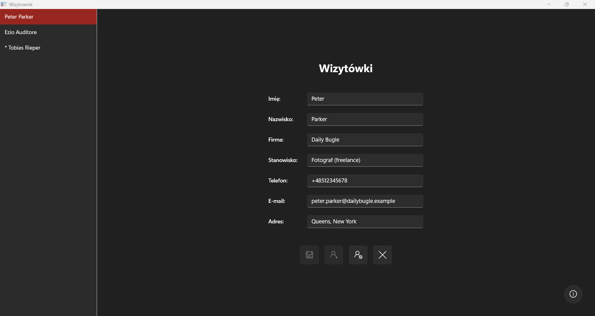

# 📇 BizCardApp

Business card management app.  
Add, edit, and store contact details for clients and companies.  
Quick search and simple interface keep your contacts organized.

## 🎬 Demo



## ✨ Features

- Single-view dashboard: contact list and card details side by side
- Business cards with name, company, position, phone, email, and address
- Add, edit, and delete contacts
- Quick search through contact list
- Instant card preview on selection
- Revert changes to last saved state
- Quick actions: save, add contact, delete contact, clear/reset
- Windows 11 Mica backdrop; follows system Light/Dark theme; clean, panel-based layout

## 📦 Installation

Download

- [BizCardApp.zip](https://github.com/Hansik33/BizCardApp/releases/latest/download/BizCardApp.zip) — app (BizCardApp.exe + appsettings.json + LICENSE + CREDITS.md)
- [BizCardApp.sql](https://github.com/Hansik33/BizCardApp/releases/latest/download/BizCardApp.sql) — database dump

Requirements

- Windows 11
- MySQL Server 8.0
- .NET 8 Desktop Runtime (only if the build isn't self‑contained)

Quick install (default config)
`appsettings.json` (included):

```json
{
  "ConnectionStrings": {
    "Default": "server=localhost;port=3306;database=bizcardapp;user=root;password=qwertyz1234!"
  }
}
```

1. Install & start MySQL (localhost:3306).
2. Create DB and import dump:

```bash
mysql -u root -p -e "CREATE DATABASE IF NOT EXISTS bizcardapp CHARACTER SET utf8mb4 COLLATE utf8mb4_unicode_ci;"
mysql -u root -p bizcardapp < BizCardApp.sql
```

3. Unzip `BizCardApp.zip` and run `BizCardApp.exe`.  
   Tip: SmartScreen → More info → Run anyway.

Use your own config
Edit `appsettings.json` to match your DB:

```json
{
  "ConnectionStrings": {
    "Default": "server=localhost;port=3306;database=bizcardapp_dev;user=bizcard;password=StrongPassword!"
  }
}
```

Recommended: create a dedicated DB user

```sql
CREATE USER 'bizcard'@'localhost' IDENTIFIED BY 'StrongPassword! ';
GRANT ALL PRIVILEGES ON bizcardapp. * TO 'bizcard'@'localhost';
FLUSH PRIVILEGES;
```

Update / Uninstall

- Update: replace files from a newer ZIP (keep your customized `appsettings.json`).
- Uninstall: delete the unzipped folder; drop the DB to remove data.

Security note

- The default root credentials are for local testing only. For your own setup, create a dedicated MySQL user and change the password.

## 🧭 Usage

1. Launch the app

   - Run `BizCardApp.exe`.

2. Add your first contact

   - On first launch (or when no contacts exist), fill in the details on the right panel.
   - First name and last name are required; other fields are optional.
   - Click add to create the contact — it saves automatically.

3. Add more contacts

   - Click add to create a blank contact.
   - Fill in the details and click save.

4. Browse contacts

   - Contact list on the left shows entries in the order they were added.
   - Scroll through the list to find contacts.

5. View and edit

   - Click any contact on the left to load it in the right panel.
   - Edit fields directly and save changes.

6. Manage contacts
   - Use quick actions: save current, add new, delete, or reset to last saved state.

### Notes

- All contacts are stored in a single shared database (no user accounts).
- The app follows your Windows light/dark theme automatically.
- Database connection comes from `appsettings.json` (ConnectionStrings: Default).

## 🚀 Deployment

Quick steps to build and package a Windows release from this repo.

### Prerequisites

- Windows 11, Git, . NET SDK 8.0, MySQL 8.0 (for runtime usage)

### 1) Clone

```bash
git clone https://github.com/Hansik33/BizCardApp.git
cd BizCardApp
```

### 2) Publish (self-contained, win-x64, single file)

```bash
dotnet restore
dotnet publish ./BizCardApp/BizCardApp.csproj -c Release -r win-x64 --self-contained true -p:PublishSingleFile=true -p:IncludeNativeLibrariesForSelfExtract=true -o dist/BizCardApp
```

### 3) Include config and SQL dump

- Ensure `dist/BizCardApp/appsettings.json` has your connection string.
- Copy `BizCardApp.sql` next to the EXE (for users to import).

### 4) Ensure license and credits are included

- Place `LICENSE` and `CREDITS.md` next to the EXE (or configure the project to copy them automatically at publish):

```xml
<ItemGroup>
  <None Include="..\CREDITS.md" Link="CREDITS.md" CopyToOutputDirectory="PreserveNewest" />
  <None Include=". .\LICENSE"    Link="LICENSE"    CopyToOutputDirectory="PreserveNewest" />
</ItemGroup>
```

### 5) Package

```powershell
Compress-Archive -Path dist/BizCardApp\* -DestinationPath BizCardApp.zip -Force
```

### 6) Release on GitHub

```bash
git tag vX.Y. Z
git push origin vX.Y. Z
```

- Create a new GitHub Release for tag `vX.Y.Z`.
- Upload `BizCardApp.zip` and `BizCardApp.sql`.

### Notes

- For a smaller download (requires .NET 8 Desktop Runtime on target machines), publish framework-dependent:

```bash
dotnet publish ./BizCardApp/BizCardApp.csproj -c Release -o dist/BizCardApp
```

## 🆘 Support

If you run into a problem:

- Check existing issues: [Issues](https://github.com/Hansik33/BizCardApp/issues)
- Open a new issue and include:
  - Steps to reproduce
  - Screenshots or error messages
  - Environment: Windows version, MySQL version, app version

## 🙌 Credits

- Icon: "Card" by Freepik, from [Flaticon](https://www.flaticon.com/free-icon/card_1726620?term=card+id&page=1&position=2&origin=style).  
  Licensed under the [Flaticon License](https://www.flaticon.com/legal) (attribution required).  
  More details: see [CREDITS.md](CREDITS.md).

## 📜 License

Code: MIT — see [LICENSE](LICENSE).  
Third‑party assets retain their own licenses — see [CREDITS.md](CREDITS.md).
